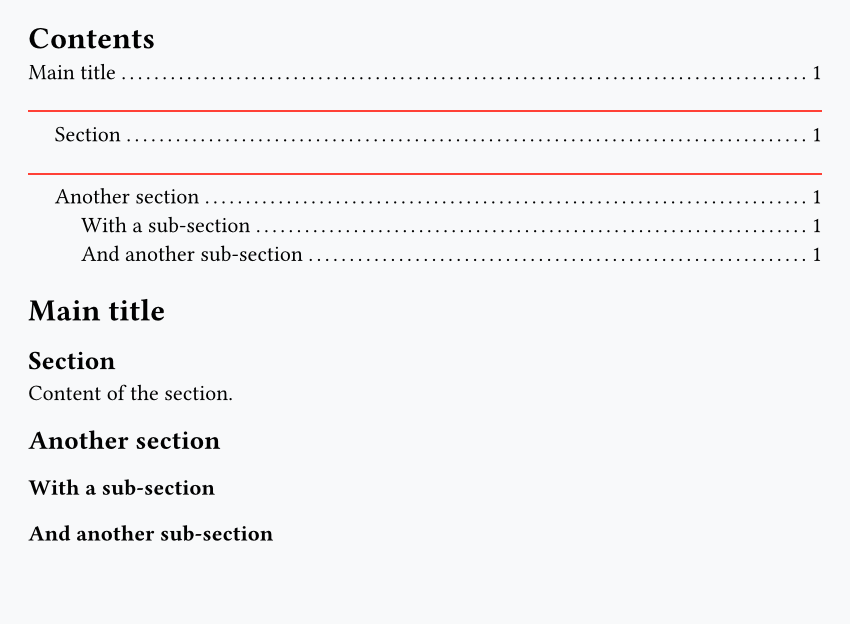
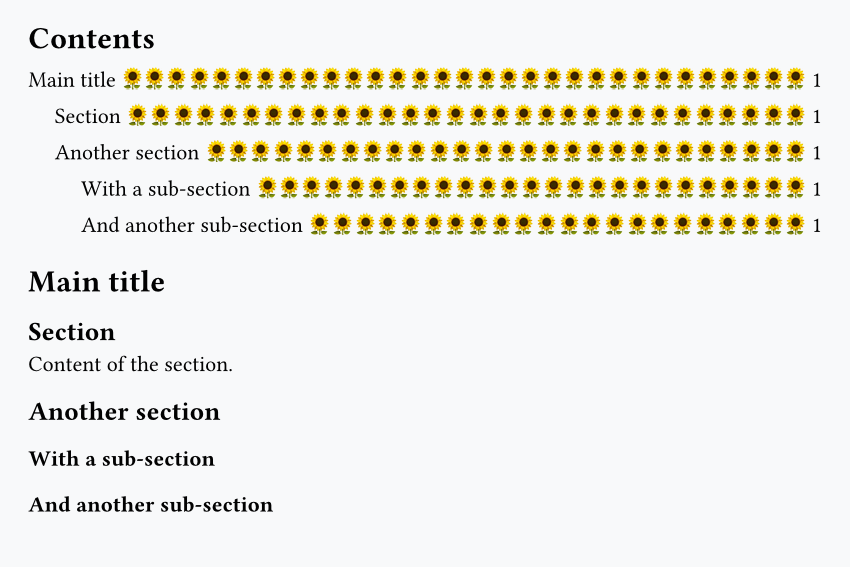

Typst has an `#outline()` function that, when called, adds a table of contents (TOC) with all the headings from your document. For example:

```typst
#outline()

= Main title
== Section

Content of the section.

== Another section
=== With a sub-section
=== And another sub-section
```


One interesting thing here is that we can call `#outline()` **before** the actual headings, and it still works. This is a convenient feature because it lets us write the document exactly in the same order as it will be printed.

Another nice thing is that, by default, it adds a link to the page where the heading appears.

## Filter headings

The `#outline()` function has an argument to specify the maximum level of `depth` for headings in the TOC:

```typst
#outline(depth: 2) // keeps only level 1 and 2 headings

= Main title
== Section

Content of the section.

== Another section
=== With a sub-section
=== And another sub-section
```


## Add content between headings

Thanks to [show rules](../crash-course/lesson-3.md), we can precisely control what happens when a heading is shown in the TOC. For example, let's add a red line above level 2 headings.

```typst
#show outline.entry.where(level: 2): it => {
  v(0.3cm)
  rect(fill: red, height: 1pt, width: 100%)
  it
}

#outline()

= Main title
== Section

Content of the section.

== Another section
=== With a sub-section
=== And another sub-section
```



## Style a specific heading differently

You might want to add some content or styling to a single heading, and the best way to do so is basically to use an `if` statement.

For example, here we check when the first appendix section occurs, and add a bit of content to specify that the appendix section is a work in progress:

```typst
#show outline.entry: it => {
  if it.element.body.text == "Appendix A" {
    v(0.5cm)
    rect(fill: red, height: 1pt, width: 30%)
    text(size: 12pt, fill: blue, "Appendix (work in progress)")
  }
  it
}

#outline()

= Main title
== Section

Content of the section.

== Another section
=== With a sub-section
=== And another sub-section

== Appendix A
== Appendix B
```


## Remove or customize the dots

You can remove all the dots in the TOC with this [set rule](../crash-course/lesson-3.md):

```typst
#set outline.entry(fill: none)

#outline()

= Main title
== Section

Content of the section.

== Another section
=== With a sub-section
=== And another sub-section
```


You can change the symbol used to pretty much anything you want:

```typst
#set outline.entry(fill: repeat("🌻"))

#outline()

= Main title
== Section

Content of the section.

== Another section
=== With a sub-section
=== And another sub-section
```


